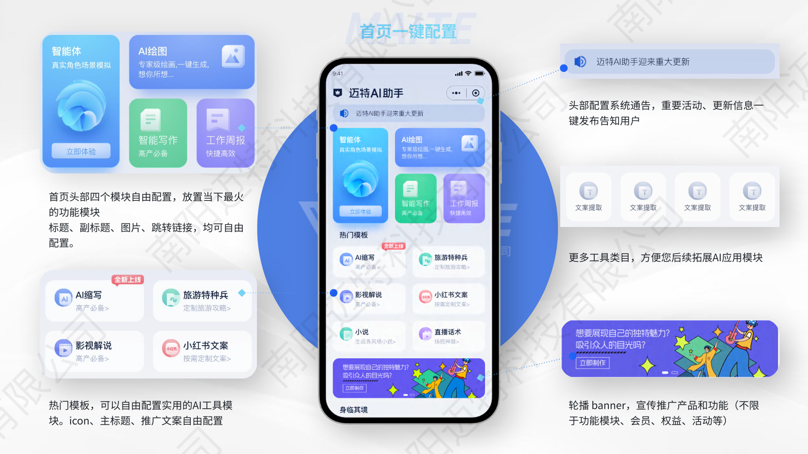
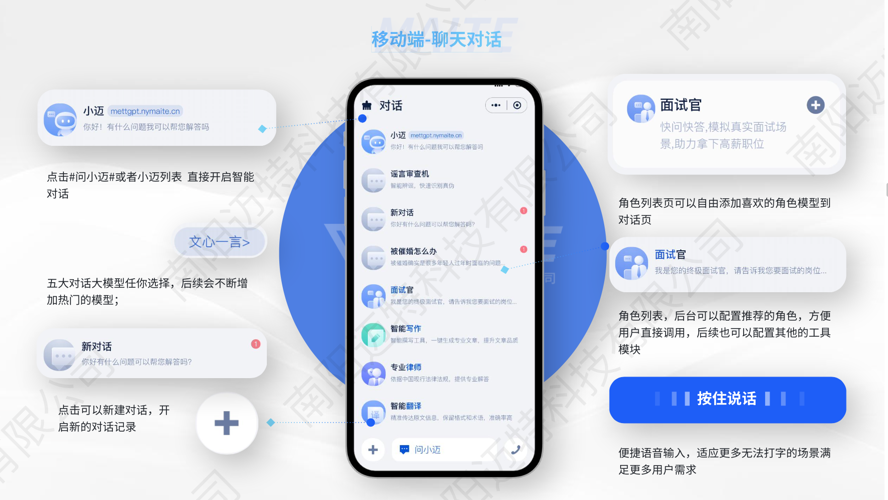
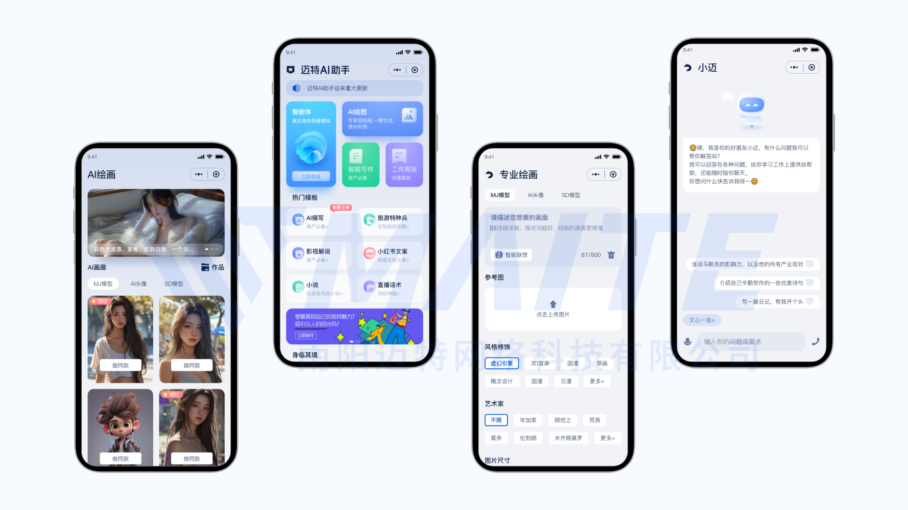
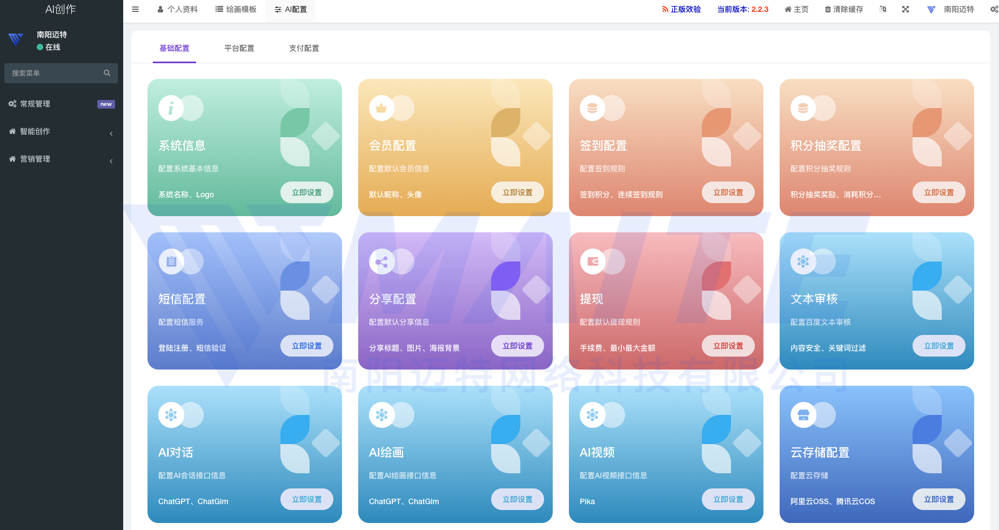

#### 介绍
提供商业运营版chatgpt/文心一言/通义千问AI聊天+SD绘画+MJ绘画+sora/pika/runway视频生成，具备H5+APP+PC+公众号等多端协作。本项目是基于chatgpt开发的一款聊天机器人应用，前端采用uniapp框架，后端采用php fastadmin workman开发。该应用可以实现智能聊天、语音识别，为用户提供更加便捷、智能的聊天体验。我们将该项目开源，希望能够为广大开发者提供参考和借鉴，也欢迎大家一起参与贡献，共同推动聊天机器人技术的发展。

开源是希望为一些初级开发人员提供一些学习的途径，后续我们将会保持长久的更新和系统优化，如果您需要商用或者要全开源源码请联系我们。
 
- 端口：PC端、微信小程序端、H5、微信公众号、、APP端
- 技术：PHP、VUE、UNIAPP、
- 支持二次开发，有完善的开发文档以及售后群内指导

####系统演示

- 
- PC端演示（新版）：https://ai.nymaite.cn/pc
- 移动端演示地址 ：https://ai.nymaite.cn/h5 

#### 功能介绍 
- 1.SAAS无限多开功能；（可卖坑位，赚钱渠道增多）
- 2.角色模拟功能；（可进行身份模拟，让AI助手主动提问回复）
- 3.智能创作功能；（此功能是我们产品的亮点之一！支持后台自定义字段配置，具体可去创作模块体验）
- 4.支持多模型；（GPT3.5、GPT4、灵犀AI、api2d、Midjourney/SD 文心一言/chatglm/通义千问等）
- 5.绘画-以文生图； 
- 6.绘画-以图生图； 
- 7.绘画-流失输出；（像照片打印机一样一层一层输出）
- 8.分销商功能；（此功能为产品亮点之一，支持多级分销商自定义设置，用户购买开通分销商等级）
- 9.提现功能；（可展示自己的收入来源以及提现进度，支持微信二维码、支付宝账号、银行卡绑定）
- 10.二级分销功能；（直推、间推）
- 11.积分功能；（可充值积分套餐、查看积分使用记录、活动获取、卡密兑换）
- 12.卡密兑换功能； 
- 13.分享海报；（可进行海报分享邀请）
- 14.文章模块；（可进行图文文章的发布，功能虽小 意义重大）
- 15.PC端控制台；（可一目了然查看自己的账号信息）
- 16.AI对话功能；（可创建多组对话，并且对名称自定义，此功能可让你同时进行多份对话）
- 17.后台一键更新；（后台可一键更新，保证数据无缝衔接）
- 18.小程序一键发布；（后台可对小程序一键发布、提审、体验版二维码、更新记录等，配置更简单）
- 19.敏感词自动过滤处理；（我们系统已内置敏感词过滤，不用担心过审问题）
- 20.支持支付宝支付、微信支付。
- 21.文生视频 对接sora/pika/runway
- 22.支持思维导图生成
- 23.支持专业版绘画
- 24营销模块等

#### 安装教程

- 1. 下载代码
- 2. `npm -i`
- 3. env.js里修改自己的接口地址，如果您没有后端开发能力想把项目跑起来需进群要测试接口地址

### 功能特性
- 这里是列表文本
- 链接查看:https://product.nymaite.cn/download/3169
 
### 系统截图
- 
- 
- 
- 
- 
- 
- 
- 
- 
 
### 联系开发者
- 
- 无法扫描可加V:kaifa8898
 
### 更新记录

#### V3.0.3(2024-5-24)
⚡ 优化
- 绘画积分显示错误修复
- 分享推荐人保存修复 
- 优化公告配置
- 优化绘画修复
- 优化后台小程序配置
- 修复手机端创作异常
 

#### 版本：3.0.0 时间：2024-05-21 17:13
1. 新增 AI视频生成模块，对接pika/sora/runway
2. 新增视频创作模板功能（一键制作+视觉模版冲击，刺激付费）
3. 新增手动修复作品集绘画/视频功能
4. 新增pc端对话中断和重新生成
5. 创作工具模块功能交互优化
6. 智能体角色模块功能交互优化
7. 视频作品集仅在个人作品集页面展示（不同步到广场增加隐私性）
8. 视频模块增加极速生成的支付模式（多种支付模式，刺激支付）

移动端：
1. 视觉UI交互整体重构（全新的视觉冲击）
2. 新增系统公告模块
3. 首页新增自定义模块功能，可便于把热门功能放在显耀区域
4. 新增首页轮播图功能，可便于推广营销
5. 新增关注公众号功能，可便于私域引流关注
6. 新增ai聊天独立会话组功能
7. 新增 AI视频生成模块，对接pika/sora/runway
8. 新增视频创作模板功能（一键制作+视觉模版冲击，刺激付费）
9. 新增绘画页宣传轮播图，可便于推广营销
10. 新增绘画/视频 智能联想和词库功能（傻瓜式操作，一键填充信息）
11. 新增一键DIY 绘画制作功能
12. 新增专业绘画模块（多种参数可调节）
13. 绘画广场增加一键制作功能
14. 新增手动修复作品集绘画/视频功能
15. 新增自动签到打卡功能
16. 新增抽奖大转盘权益活动
17. 创作工具模块功能交互优化
18. 智能体角色模块功能交互优化
19. 视频作品集仅在个人作品集页面展示（不同步到广场增加隐私性）
20. 视频模块增加极速生成的支付模式（多种支付模式，刺激支付）
1. 移动端聊天对话模块交互逻辑优化
2. 修复后台用户详情用户默认头像异常
3. 修复绘画子图未生成问题
4. 修复专业绘画和简单绘图数据不统一问题
5. 优化系统升级按版本升级
6. 修改对话列表默认数据
7. 修复本地安全检测关键词替换 
8. 新增百度内容安全检测
9. 优化后端思维导图记录
10. 优化绘画列表提示词
11. 优化视频创作支持多模型
12. 优化系统升级按版本升级
13. 添加手动修复绘画不显示
14. 添加手动修复视频不显示无法播放 
15. 优化视频下载不完整无法播放
16. 优化会话列表最新数据显示
17. 修改绘图模板UV类型图片生成异常

#### 版本：2.1.3 时间：2024-04-17 09:54
 
1. 后台修复专业绘图配置
2. 修复子站点专业绘画配置无法自定义
3. 修复绘画子图未生成问题
4. 修复pc端微信扫码登录异常
5. 修复 链接频繁 前端解析异常
6. 修复 AI对话配置异常导致 移动端无法对话
7. 修复AI配置后台页面异常
8. 修复提现复制卡号异常
9. 默认后台手动处理图片生成4个图片

#### 版本：2.1.0 时间：2024-02-28 10:25
1. 后台绘图失败后，重新下载绘图逻辑
2. 图片下载逻辑 
1. 知数云绘画接口回调地址编码无法下载图片问题
2. 新老版本绘图失败后积分不能返还问题
3. 修改图片广场图片新图的排序问题
1. 新版绘画功能升级
2. 前端新版绘图ui
3. 后台获取图片关键字接口配置
4. 后台绘图辅助翻译接口配置
5. 新版绘图父级分类
6. 新版绘图子级分类
7. 绘图三级分类ico图片
8. 应用市场后台自定义配置
9. 新版绘图图片混图功能
10. 新版绘图获取图片关键字功能
11. 新版绘图图片扩展生成放大和变体功能

#### 版本：2.0.0  时间：2023-12-19 09:15
 
1. 修复workman process_timeout 问题
1. 修复短信报错，提示不全问题
1. 修复积分异常报错问题
1. 修复智普接口绘图不能用的问题
1. 修复pc小程序端异常报错问题
1. 日志小红点功能
1. 版本更新日志显示功能
1. 站点管理，锁定操作列功能
1. gpt-vision-preview 图生文的后台接口
1. gpt4 文生图功能，后台撇脂闻声图功能
1. 文生图小程序功能
1. chatgpt发送消息异常捕获
1. h5和小程序链接太频繁，chat页面空白卡死问题
1. 绘图等接口请求报错处理的方式
1. workman的调度方式为轮询，不再是之前的随机
1. 文生图的积分替换，格式返回
1. 思维导图菜单为二级菜单
 
 
#### 版本：1.8.0  时间：2023-11-14 10:22
 1. 前端增加多模型切换展示
 1. 后台支持多模型选择配置
 1. AI对话默认配置选项
 1. 百度大模型ERNIE-Bot 4.0接入
 1. 百度大模型ERNIE-Bot 4.0key池支持
 1. 讯飞星火模型接入
 1. 讯飞星火模型key池支持
 1. gpt4模型修改(删除不用的模型，新增主流模型)
 1. 服务器开小差优化
 1. 修复百度模型别名问题
 1. 绘图配置用文心一言模型修改
 1. 百度大模型4.0卡顿的问题

#### 版本：1.1.7 时间：2023-10-10 14:00
 
 1. 文心一言聊天无法发送
 1. 部分测试数据图片不显示
 1. 手机端首页绘画进入无反应问题
 1. 聊天页面AI回复内容丢失问题
 1. 优化OPENAI前置命令
 1. 优化部分错误提示
 1. 增加APP端功能
 1. PC端 - 修改 登录弹窗默认显示，验证码登录方式 -
 1. 默认不强制登录
 1. 登录弹窗调整为可关闭 
 1. 部分模块信息提示
 1. 微信小程序-语音朗读错误提示
 1. 文本域字符长度调整为无限制

 #### 版本：1.1.6 时间：2023-9-25
- 更新内容查看:https://product.nymaite.cn/download/3169
 #### 版本：1.1.5 时间：2023-9-23
- 更新内容查看:https://product.nymaite.cn/download/3169
 
 #### 版本：1.1.4 时间：2023-8-15
- 更新内容查看:https://product.nymaite.cn/download/3169
 
 #### 版本：1.1.3 时间：2023-8-12
- 更新内容查看:https://product.nymaite.cn/download/3169
 
 #### 版本：1.1.2 时间：2023-7-21
- 更新内容查看:https://product.nymaite.cn/download/3169
 
 #### 版本：1.1.1 时间：2023-7-19 
- 更新内容查看:https://product.nymaite.cn/download/3169
 
 #### 版本：1.1.0 时间：2023-7-17 
- 更新内容查看:https://product.nymaite.cn/download/3169
 
 #### 版本：1.0 时间：2023-6-7
- 更新内容查看:https://product.nymaite.cn/download/3169

### 联系开发者
- 
- 无法扫描可加V:kaifa8898